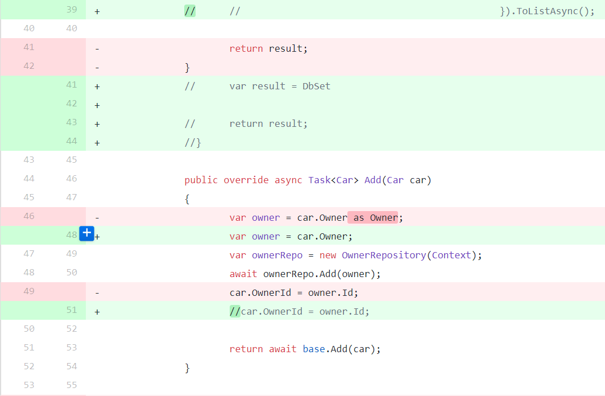
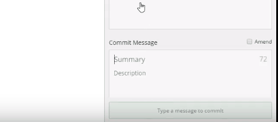
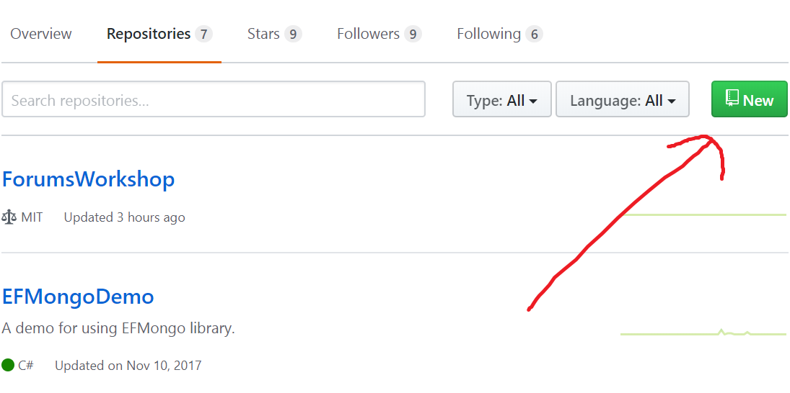
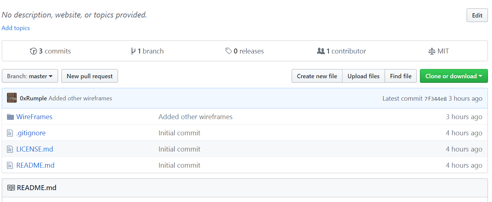

**السلام عليكم أصدقائي,**

* ## فهرس المواضيع السابقة:

  https://macdiscussions.udacity.com/t/topic/86623


* ## ماهي الخطوة القادمة ؟

  بعد أن أنتهينا من موضوع الـ WireFraming ولدينا خطة مبدأية للمشروع, نريد أن نقوم بمشاركة هذه الصور على GitHub للإعتياد على استعماله في تسليم المهام الأخرى.


* ## ماهو GitHub ؟

  هو موقع يستعمل (من قبل المطورين غالباً) لنشر المشاريع والعمل عليها بشكل تعاوني, وأيضاً يسهل عليك الحفاظ على النسخ من مشروعك بحيث إذا كان لديك النسخة 1.0 والنسخة 2.0 من مشروعك, بإمكانك أن ترى الفروق بينهم بسهولة كبيرة.

  

  بالأعلى صورة من GitHub في طريقة عرضه للفروق بين الكود القديم والجديد.

  بالنسبة لنا سنستعمله لمشاركة المهام المطلوبة بشكل متواصل وسلس باستعمال Git Client  :wink:
 
* ## كيفية التسجيل على GitHub ؟

  طريقة التسجيل سهلة جداً... شاهد الخطوات في 4 دقائق :smile:
 
  https://www.youtube.com/watch?v=7Qo-weIAL3o

* ## ماهو Git ؟

  **النظام الذي يعمل عليه GitHub**, يسمى Git.,.. و يوجد مواقع كثيرة أخرى تعتمد نظام Git مثل موقع Bitbucket وأيضاً موقع Team Foundation Service من الشركة العملاقة مايكروسوفت... هنا سنستعمل GitHub.

* ## ماهو Git Client ؟

  ببساطة هو **البرنامج الوسيط بينك وبين GitHub**, يوجد الكثير من الـ Git Clients ونحن **سنستعمل GitKraken** (برنامج بسيط وجميل) :smile: 

  يحتوي الـ Git Client على واجهة رسومية جميلة تقوم فيها بأوامر Git بدون أن تكتب الأوامر بالطريقة التقليدية. بمعنى بدلاً أن تكتب على سطر الأوامر:

   ```
   git commit
   ```

   ستقوم ببساطة بالضغط على الزر commit في برنامج GitKraken, بهذا الشكل:

  

* ## كيف أقوم بتنصيب GitKraken ؟

  توجه إلى الموقع خاصته وقم بتحميله ثم تنصيبه: https://www.gitkraken.com

  بعدها ستحتاج إلى ربط البرنامج مع حسابك على GitHub, كما في الفيديو:

  https://www.youtube.com/watch?v=5nhNfMcczlQ

* ## كيف سأقوم بعمل Repositroy جديدة ؟

  * ### ماهي الـ Repository أولاً ؟

    بإمكانك أن تعتبر أن الـ repository تعني مستودع لمشروعك أو project, بمعنى ستضع المشروع على repository في GitHub.

   * ### كيف سأقوم بإنشاءها ؟

     الأمر سهل جداً, إما من GitHub مباشرة بهذا الشكل:

     

    أو باستعمال GitKraken كونه مرتبط بحسابك, أي أنه يستطيع القيام بانشاء وتعديل الـ repositories الموجودة بحسابك على GitHub.

  * ### مالطريقة التي تفضلها لإنشاء مستودع (Repository) ورفع الـ wireframes عليه ؟

    بالتأكيد أفضل GitKraken لأنه أسرع وأسهل.

    قمت بعمل فيديو قصير مكون من ثلاث دقائق, يشرح الأمر بسهولة :

https://www.youtube.com/watch?v=YHZFAsKVg5g

* ## هل تجد هذه المفاهيم صعبة ؟

  لا مشكلة يا صديقي, بإمكانك مراجعة الدروس على الكورس وفهمها بسرعة والعودة لتطبيق ما تعلمته بشكل واقعي... فمدير عملك في المستقبل سيطلب منك أن تنشر المشروع بأسرع وقت ممكن :grin:
  
  رابط المفاهيم على الكورس:

  https://classroom.udacity.com/courses/ud004-track-1mac/lessons/1b369991-f1ca-4d6a-ba8f-e8318d76322f/concepts/06b0775b-b703-45ca-9935-939487706728

* ## ماهي المهمة المطلوبة ؟

  * قم بعمل حساب GitHub.
   * قم بتحميل GitKraken أو أي برنامج تفضله.
   * قم بربط برنامج GitKraken مع حسابك على GitHub.
   * قم بعمل مستودع (Repository) للمشروع.
   * قم بوضع الـ wireframes  التي قمنا برسمها على المستودع.
   * قم بمشاركة رابط المشروع معنا.
 
* ## النتيجة المطلوبة:

  شيء مثل هذا سيفي بالغرض:
  
   

  رابط المستودع الذي أنشأته في الفيديو: 

https://github.com/0xRumple/ForumsWorkshop

* ## بإمكانك أن تفسد المتعة هذه المرة :smile: :

  بمجرد أن تنتهي, بإمكانك أن تنشر الحل في الموضوع المخصص له:
  https://macdiscussions.udacity.com/t/4-git-github/84131
  

  **في حال لديك أي استفسارات** , تفضل بالسؤال في هذا الموضوع.

  أتمنى لكم الفائدة والتوفيق :blush: 


**شكر خاص للأخ @pplosd على مساعدتي في ايجاد الفيديوهات المذكورة.**
